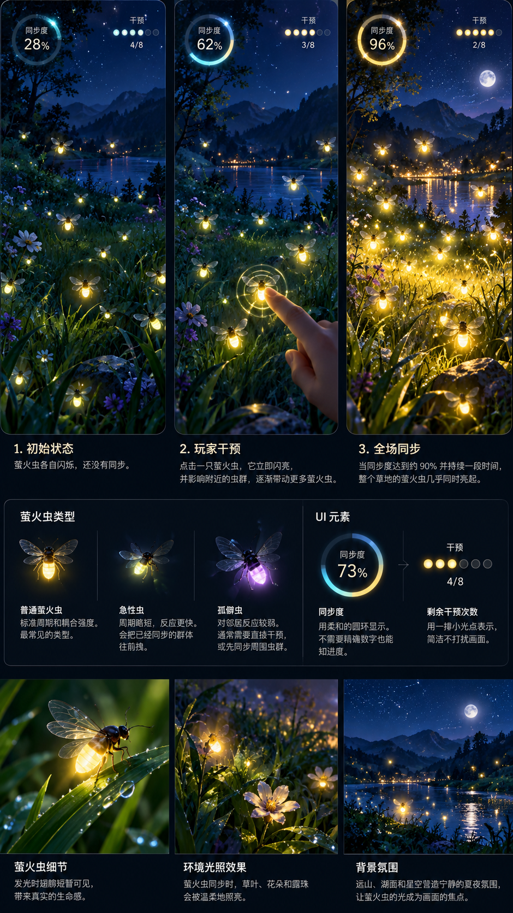

# 《萤火信号 Firefly Signal》开发任务

> 状态：Gameplay Prototype 开发方案 · 2026-09-26  
> Repository: `mingzhangyang/games`  
> 视觉基准：[`assets/firefly-signal/concept-midsummer-harmony.png`](../assets/firefly-signal/concept-midsummer-harmony.png)



## 1. 目标

为 games 项目开发新游戏 **《萤火信号 / Firefly Signal》**。玩家通过有限次数地干预单只萤火虫，让原本不同步的虫群逐渐形成局部同步，最终产生全局同步。

本轮重点不是完成大量关卡，而是验证：

1. 玩家能否通过观察闪烁规律理解“点击一只萤火虫会影响附近虫群”，并形成策略，而不是随机点击。
2. 从杂乱闪烁逐渐进入全场同步的瞬间，是否具有足够强的视觉、声音和游戏反馈。

如果这两点没有成立，不要通过增加关卡或更多机制掩盖问题。

## 2. 部署与架构

不建立新的 Cloudflare Worker。游戏继续属于现有 games 应用：

`games.orangely.xyz/firefly-signal.html`

继续复用现有 Vite 多页面构建、games registry、shared chrome、analytics、leaderboard 与 Daily 基础设施。本轮 Prototype 暂不要求完成 leaderboard / Daily 产品化。

## 3. Immersive Stage

新增正式、可复用的 **Immersive Stage** 布局，未来《影织》等重场景游戏也可以复用。

建议在 `games.config.json` 增加：

```json
"layout": "immersive"
```

缺省为 `standard`。不要使用 cap 表示互斥布局类型。现有游戏未声明 `layout` 时行为必须完全不变。

页面保留 shared topbar，Topbar 以下的剩余 viewport 尽量全部属于游戏场景。HUD 是场景 overlay，而不是独立 panel。

移动端重点验证 390×844、393×852、430×932；高度应基于 `100dvh - actual chrome - safe area`，不能使用固定魔数。桌面纵向舞台宽度控制在约 600–640px，并以深夜背景自然延展两侧。

优先复用/扩展现有 `js/game-frame.js` 的 `bindFrame()`，不要重复实现 ResizeObserver、resize、`game-frame:changed` 和反馈环保护。

## 4. 视觉方向

整体定义：

**绘本自然主义 × 仲夏夜 × 生物荧光 × 少量科学可视化**

不是霓虹 UI，也不是普通卡通小游戏。

推荐纵向构图：

- 顶部 25%：夜空、月亮、远山、HUD、少量远景萤火虫。
- 中部 30–35%：湖岸、水面、中景草地和不同虫群之间的连接区域。
- 底部 40–45%：主要可玩草地、花、露珠和大部分可点击萤火虫。

不要直接把概念图当成大型静态背景。场景应拆为 sky / mountains / lake / far meadow / near meadow / flowers / dew / fireflies / dynamic light / HUD。

静态层可使用 DOM/CSS/SVG；萤火虫、翅膀、光晕、交互脉冲、环境照明和同步效果建议使用 Canvas。

## 5. 萤火虫视觉

萤火虫不要只是黄色圆点。即使尺寸很小，也应表现 dark body、translucent wings 与 glowing abdomen。

普通状态只有微光；接近闪烁时腹部增强；闪烁瞬间出现暖金色光晕，并让透明翅膀短暂被自身光照亮，之后快速衰减。

群体同步的主要视觉奖励来自**环境被虫群同时照亮**，不要使用彩带、烟花、巨大的 PERFECT 等传统奖励特效。

## 6. Simulation

Simulation 与 Renderer 必须解耦。每只萤火虫至少包含：

```js
{
  x,
  y,
  phase,
  period,
  coupling,
  radius,
  type
}
```

`phase ∈ [0,1)`，到达 1 时闪烁并回到 0。萤火虫闪烁时对附近同伴产生 pulse：

`phase += coupling × distanceFalloff × responseCurve`

不要求严格实现完整 Kuramoto model，游戏体验和可调性优先。但需保持直觉：距离越近影响越强、可形成局部同步、局部群体可经桥接虫逐渐合并。

使用 fixed timestep（建议 1/60s）和 seeded RNG。目标是：

**same seed + same player input sequence = same simulation result**

## 7. 三种萤火虫

Prototype 只做三种：

- **Normal**：标准周期、耦合和移动，暖金色。
- **Fast**：周期较短、移动略快、体型略小、翅膀更频繁，光色可略偏青黄。
- **Solitary**：耦合较低、稍大、移动较慢、更偏离群体、光晕柔和。

特殊萤火虫不是“敌人”，避免 RPG 式属性颜色和“消灭坏虫”的语义。

## 8. Harmony

不要用“当前亮着多少虫”计算同步度。使用 circular order parameter：

`phase → angle 0...2π → unit vector → average vector magnitude`

自然映射为 0–100%。HUD 显示值需要 smoothing，避免高速抖动。

## 9. 玩家干预

点击一只萤火虫：

1. 它立即闪烁；
2. phase reset；
3. 附近虫获得 pulse；
4. 消耗一次 intervention。

点击后显示非常克制的扩散圆，让玩家知道影响范围。视觉虫体可以很小，但移动端实际 hit target 应接近或达到 44px。需要防止 accidental double taps、页面滚动、文本选择和 double-tap zoom。

## 10. HUD

HUD 直接悬浮在天空区域，只保留：

- Harmony / 同步度：例如 `◯ 73%`
- Interventions / 干预次数：例如 `● ● ● ● ○ ○ ○ ○`

不要大型 panel/card。HUD 背景透明，只允许轻微对比增强。

## 11. Prototype Levels

本轮只做三个经过设计的场景，不要直接做 20 关。

### Level 1 — First Light

- 8 Normal
- 最多 3 次干预
- Harmony ≥ 85% 持续约 2 秒

第一次玩家最好在 10–20 秒内看到第一次全场同步。

### Level 2 — Two Meadows

- 约 18 Normal
- 两个局部群体，中间存在少量 bridge fireflies
- 最多 5 次干预

目标是让玩家理解“不需要一只只点，而应该寻找连接群体的关键个体”。

### Level 3 — Midsummer

- 25 Normal
- 3 Fast
- 2 Solitary
- 最多 8 次干预
- Harmony ≥ 90% 持续约 2 秒

这是本轮最终 Prototype，也是概念图对应的主要场景。

## 12. Success Sequence

不要达到目标后立即弹 modal。

推荐：

target harmony → hold ~2s → HUD fade → 全体进入同步 → 连续 3 次群体闪烁 → 草/花/露珠/水面被照亮 → 柔和完整和弦 → 短暂停顿 → result UI。

Result UI 也应克制，例如：

```text
Midsummer Resonance

Harmony 96%
3 / 8 interventions

Continue
```

## 13. Environmental Lighting

这是视觉质量的核心功能，不是最后才加的 polish。

Firefly flash 应产生局部 illumination。第一版可使用 Canvas radial gradients、compositing 或预制 highlight layers，让附近 grass edges、flowers、dew、water reflections 短暂响应。

需要在普通移动设备上保证 30–60 只萤火虫流畅运行。必要时缓存静态层、降低 glow resolution、批量绘制，并限制 Canvas DPR。

## 14. Audio 与 Reduced Motion

单只萤火虫闪烁基本无声；局部同步形成时加入极轻的 glass/bell harmonic；Harmony 经过 60% / 75% / 90% 时逐渐增加和声层；全局同步形成柔和完整和弦。Audio OFF 时游戏信息必须完整。

支持 `prefers-reduced-motion`：减少拖尾、大范围扩散和背景运动，但保留必要亮度变化与 HUD 信息。

## 15. Theme

《萤火信号》定义为 **dark-only game**。不要添加 `theme-light`。夜色和生物荧光属于玩法可读性的一部分。

## 16. 推荐代码结构

```text
firefly-signal.html

js/firefly-signal/
  main.js
  game.js
  simulation.js
  renderer.js
  levels.js
  audio.js

css/
  firefly-signal.css

assets/firefly-signal/
  concept-midsummer-harmony.png
  ...
```

## 17. Development Phases

### P0 — Immersive Stage
完成 registry `layout`、contract documentation、layout CSS、frame integration、mobile safe area、desktop max-width 与 verification。验收：现有所有游戏视觉和行为零回归。

### P1 — Simulation
完成 deterministic fixed timestep、seeded RNG、phase/pulse coupling、三种萤火虫、Harmony、玩家干预以及 simulation tests。

### P2 — Visual Prototype
完成主要场景构图、firefly rendering、wings、glow、environmental lighting、HUD、interaction pulse、同步高潮和初始 audio。目标是接近概念图气氛，而非普通 science-game panel 风格。

### P3 — Gameplay Prototype
完成 First Light、Two Meadows、Midsummer、教程、success flow、restart、basic stats 与 mobile interaction polish。

**P3 完成后停止扩展内容并进行玩法评估。**

## 18. 本轮不要做

暂不提前实现：

- 20 个正式关卡
- Endless / Night Watch
- 完整 Daily Challenge
- leaderboard 产品化
- achievements
- 大量特殊萤火虫
- monetization
- complex progression
- user accounts

## 19. Tests

至少覆盖：

- phase progression / flash reset / distance coupling
- Normal / Fast / Solitary 差异
- Harmony calculation
- seeded RNG 与 deterministic replay
- 390×844、393×852、430×932、1280×800、1440×900 布局
- touch target / scroll prevention / double tap / resize / orientation / restart / intervention count

必须运行仓库现有 `npm run gen`、`npm run verify` 以及相关 lint/build/test。不要删除或弱化 verification 来让 CI 通过。

## 20. Git / PR

从最新 `main` 创建 `feat/firefly-signal`。不再执行 feature → develop → main 的冗余流程。

可按 P0/P1/P2/P3 组织清晰 commits。完成 P3 后创建 PR 到 `main`。PR 描述需说明 Immersive Stage architecture、simulation model、determinism strategy、visual implementation、tests、mobile behavior、known limitations 与后续建议。

## 21. 最终验收

第一次试玩应尽可能产生：

- 0–5 秒：“这些萤火虫为什么各闪各的？”
- ~15 秒：“点一只好像会影响附近的虫。”
- ~30 秒：“我是不是应该点这个群体中间的？”
- 点击 bridge firefly → 局部群体逐渐合并 → 整片草地同时亮起。

目标体验是：

**“原来如此。”**

如果 P3 后主要策略仍然是随机快速点击，不要继续堆关卡；优先调整 coupling model、初始 phase、视觉反馈、interaction pulse、level topology 与 intervention limits。