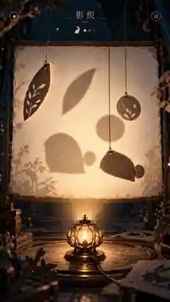
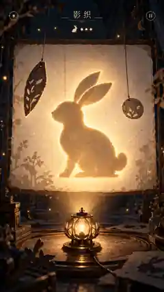
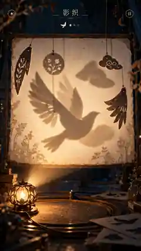

# 《影织 Shadow Loom》设计方案

> 状态：视觉与玩法基准 · 2026-09-26  
> Repository: `mingzhangyang/games`  
> 视觉资产：`assets/shadow-loom/`

## 1. 一句话定义

**移动不同深度的剪纸碎片与一盏灯，让它们投下的多个影子逐渐重合，最终“织”成一个完整的生命或意象。**

玩家移动的是纸片，但真正观察和塑造的是影子。不同深度让同样的位移产生完全不同的投影变化，因此核心乐趣来自建立“空间—光源—投影”之间的直觉。

## 2. 核心体验

《影织》不是普通拼图，也不是单纯对齐轮廓的几何题。

一关开始时，纸幕上只有一个很淡的目标意象。幕后的剪纸碎片当前投出散乱、看似无关的影子。玩家通过拖动纸片、旋转纸片，以及在中后期拖动灯源，让多个阴影逐渐靠近目标。

理想的完成体验不是“我把拼图拼好了”，而是：

**“原来这些碎片在光里可以变成它。”**

这个突然产生意义的瞬间，是整款游戏最重要的奖励。

## 3. 视觉方向

整体定义：

**现代纸艺剧场 × 手工装帧 × 微型舞台 × 暖色投影**

避免传统红色剪纸、廉价卡通、霓虹 UI 和大量面板。画面应安静、诗意、精致，并具有真实的纸张、木材、铜件和灯光质感。

主色：

- 深靛蓝 / 墨蓝背景
- 暖米白半透明纸幕
- 琥珀色灯光
- 少量暗铜色
- 极少量青绿色环境层次

《萤火信号》是自然世界中的生命光；《影织》则是黑暗剧场里的人工光。

## 4. Immersive Stage

沿用《萤火信号》建立的 Immersive Stage 设计原则。

共享 topbar 保留，但 topbar 以下尽量全部属于游戏世界。HUD 是场景 overlay，不是独立 panel。

手机竖屏时：

- 顶部：极简标题、目标剪影、进度标记。
- 中央约 65–70%：半透明暖白纸幕，是主要可玩区域。
- 幕幕后方：2–5 块位于不同深度的悬挂剪纸。
- 底部：一盏琥珀色灯，是重要的交互视觉元素和视觉重心；在支持灯光控制的关卡中可以拖动，在早期教学关卡中保持固定。

不要加入传统 slider、方向键或大型控制面板。

## 5. 纸幕与材质

纸幕不是纯白 UI 面板，而是一张真实存在于舞台里的半透明纸：

- 能看见极淡的天然纤维；
- 边缘略微不规则；
- 被灯照亮时产生柔和透射；
- 不同区域亮度随光源位置变化；
- 四周可以有非常淡的植物或舞台环境影子，但不能影响主谜题可读性。

剪纸本身需要有：

- 微小不规则边缘；
- 轻微毛边；
- 薄薄的纸张厚度；
- 细微纸纤维；
- 被背光照亮时的暖色边缘；
- 停止拖动后的轻微惯性晃动。

目标是避免“SVG 图标在网页上移动”的感觉。

## 6. 投影表现

影子不使用纯黑。

不同深度的纸片需要产生不同的：

- 尺寸；
- 位移响应；
- 边缘锐度；
- 模糊程度；
- 重叠深浅。

多个影子重叠时颜色变深。靠近正确位置时，局部轮廓出现极弱的暖金色“缝合”细线。

视觉本身应帮助玩家理解深度关系，不需要大量文字教程。

### 6.1 2.5D 投影映射模型

实现时使用统一的点光源透视投影模型，避免渲染、判定和关卡设计各自使用不同近似。

设：

- 灯源位置为 `L = (Lx, Ly, Zl)`；
- 某个剪纸点为 `P = (Px, Py, Zp)`；
- 纸幕平面为 `Z = Zs`；
- 深度满足 `Zl < Zp < Zs`。

从灯源经过剪纸点的射线与纸幕相交于 `S`，投影比例：

`t = (Zs - Zl) / (Zp - Zl)`

因此幕布上的投影位置为：

`Sxy = Lxy + (Pxy - Lxy) × t`

如果将灯源深度归一化为 `Zl = 0`、纸幕为 `Zs = 1`，则：

`Sxy = Lxy + (Pxy - Lxy) / Zp`

这意味着：

- 纸片越靠近灯（`Zp` 越小），投影放大越明显，横向移动在幕布上的响应也越大；
- 纸片越靠近纸幕（`Zp` 越接近 `Zs`），投影尺寸和位置越接近纸片本身；
- 移动灯源会同时改变所有纸片的投影，但不同深度产生不同幅度的视差。

纸片旋转应先在自身局部坐标中完成，再通过同一投影公式映射到幕布。判定 mask 必须来自与视觉渲染相同的投影结果，不能另写一套“近似位置”。

边缘模糊不参与几何判定。视觉上可让 blur 随“纸片到纸幕的距离”增加，并设置上限，以模拟软阴影；最终参数以可读性和移动端性能为准，而不是追求完整物理光学模拟。

## 7. 核心操作

### 拖动纸片

直接拖动当前剪纸。不同深度的纸片在幕布上的投影响应不同。

### 旋转纸片

中期关卡开始开放。选中后只出现非常克制的弧形把手或手势提示，不做传统编辑器式旋转控件。

### 拖动灯

中后期开放。拖动底部灯源会让所有不同深度的影子同时产生视差变化。

第一版不让玩家直接控制 Z 深度。每块纸片的深度由关卡设计预设，避免自由度过高导致玩法退化成 3D 编辑器。

## 8. 判定

后台将当前投影与目标图案渲染为低分辨率 mask。

建议组合：

- 区域重合度（IoU）
- 轮廓距离 / shape distance

得到内部相似度，但不要让玩家一直盯着巨大百分比。

推荐反馈：

- 约 70%：局部正确轮廓出现极弱暖色边线；
- 约 85%：纸幕亮度和环境泛音轻微增强；
- 约 90%：多个影子边缘开始像被金线缝合；
- 约 93% 并持续 0.3–0.5 秒：触发完成。

阈值需要通过实际试玩调校，不要把某个数字当作固定设计真理。

## 9. 完成奖励：影子活过来

不要使用传统 `LEVEL COMPLETE` 大字、彩带或烟花。

完成后：

1. 杂乱的半透明边缘短暂收紧；
2. 暖金色光线沿完整轮廓快速流过；
3. 周边剪纸和背景略微暗下；
4. 完整影子成为唯一视觉焦点；
5. 影子产生 2–3 秒极短的“生命动作”。

示例：

- 兔子：耳朵动一下，向前跳两步；
- 飞鸟：展开翅膀飞过幕布；
- 鹿：抬头；
- 树：枝叶被风吹动；
- 鲸鱼：缓慢摆尾。

玩家应该感到自己“用光创造了一个生命”。

## 10. 关卡成长

### 初影

2 块纸片，固定灯，不允许旋转。只理解“纸片位置与影子位置并不一一对应”。

### 错层

加入第三个深度，让玩家第一次明显感受到相同拖动距离产生不同投影响应。

### 灯行

开放移动灯源。玩家开始从“移动单个碎片”转向控制整个投影系统。

### 回旋

开放纸片旋转，可使用鸟翼、鹿角、树枝、人物侧脸等复杂目标。

### 活影

4–5 个对象。目标轮廓不再持续显示，只在开始或轻触目标图标时短暂浮现，从“对轮廓”逐渐变为“从记忆中找回形象”。

## 11. 节奏与失败

主模式不使用：

- 倒计时；
- 生命值；
- 连续错误惩罚；
- 强制失败页面。

允许玩家慢慢观察光与空间关系。

完成后可记录：

- 完成时间；
- 移动次数；
- 最高匹配度；
- 是否一次完成。

这些数据放在结果层，不打扰解谜过程。

## 12. 声音

声音保持极简：

- 拖纸：轻微纸张摩擦；
- 旋转：细木轴 / 纸线牵引声；
- 拖灯：极弱火焰声；
- 越接近目标：逐渐出现非常淡的泛音；
- 完成：一两个清晰的弦音或木琴音；
- 活影动作：极轻环境音，例如振翅、树叶或水声。

Audio OFF 时所有玩法信息仍需完整。

## 13. 推荐首关：兔

首关使用三块简单剪纸：

- 椭圆主体；
- 长叶形纸片；
- 小圆片。

灯固定，不能旋转，只允许拖动纸片。

三个影子逐渐形成坐姿兔子侧影。完成后兔耳轻轻动一下，再跳出画面。

首关尽量不使用文字教程，让操作与反馈本身完成教学。

## 14. 四张视觉基准

### A. 未解状态

用途：定义关卡开始时碎片分散、影子仍然抽象的视觉状态。

### B. 接近完成 / 操作中

用途：定义主要 gameplay 画面、纸张材质、灯源、选中纸片、不同深度投影和“将成未成”的目标状态。

### C. 完成瞬间

用途：定义成功反馈的光线、焦点转移与轮廓缝合效果。后续实现时应保持克制，不要演变成普通手游胜利特效。

### D. 高级光源玩法

用途：定义高级关卡中移动灯源、更多纸片和明显视差时的空间感。该图主要作为气氛与构图参考，具体鸟形谜题仍需根据可验证的投影几何重新设计。

## 15. 实现原则

视觉稿是美术与交互方向，不应直接作为一整张静态背景。

建议拆分为：

- stage background；
- paper screen；
- frame / strings；
- paper pieces；
- lamp；
- projected shadows；
- dynamic lighting；
- HUD；
- success outline / living-shadow animation。

核心纸片位置、光源位置和投影必须由实时逻辑驱动，确保视觉反馈和判定来自同一个状态。

## 16. Prototype 范围

第一轮只需要验证三个问题：

1. 拖动纸片时，玩家能否很快建立对深度投影关系的直觉；
2. 拖动灯源是否真的产生新的策略，而不是增加无意义自由度；
3. “碎片突然成为完整生命”的完成瞬间是否足够有吸引力。

建议 Prototype 只做 3 个经过设计的关卡：

- Rabbit / 兔：移动纸片；
- Bird / 鸟：加入不同深度；
- Deer or Tree / 鹿或树：加入移动灯源与旋转。

Prototype 成立后再扩展正式关卡。

## 17. 与 Games 项目的关系

《影织》与《萤火信号》应共享同一套高层设计语言：

**让游戏世界自己成为界面，而不是把游戏塞进 UI 面板。**

但两者的体验必须明显不同：

- 《萤火信号》：开放自然空间、群体涌现、从混沌产生秩序；
- 《影织》：封闭微型舞台、精确空间关系、从碎片产生形象。

这两款游戏可以共同成为 Games 项目 Immersive Stage 的视觉基准。

## 18. 实现记录（2026-09-26）

首版已上线：`shadow-loom.html`，6 幕覆盖全部五章（Prototype 的兔 / 鸟 / 鹿或树之外补了鲸与鹤）；2026-09-27 补入月下亭与锦鲤，现为 8 幕。

| 幕 | 章 | 纸片 | 机制 |
| --- | --- | --- | --- |
| 兔 | 初影 | 3（2 个深度） | 灯固定、只能拖纸片 |
| 飞鸟、鲸 | 错层 | 3（3 个深度） | 同样的拖动，影子走的距离不同 |
| 鹿 | 灯行 | 3，鹿角钉住 | 拖灯；钉住的纸片只能靠灯对准 |
| 月下亭 | 灯行 | 3，月亮钉住 | 拖灯把月亮挂到亭角上方（2026-09-27 补） |
| 树 | 回旋 | 4，树干钉住 | 拖灯 + 拖铜钮旋转 |
| 锦鲤 | 回旋 | 4，鱼身钉住 | 拖灯 + 旋转鱼头 / 鳍 / 尾（2026-09-27 补） |
| 鹤 | 活影 | 5，身体钉住 | 目标只在开场与轻触顶栏图标时浮现 |

实现要点：

- **同源投影**：`src/games/shadow-loom/model/rules.js` 是渲染、判定、校验器共用的唯一几何内核（§6.1 公式原样实现）。
  纸片形状按「影子尺度」定义，纸片本体 = 影子 × z；关卡的解写成影子中心，纸片摆位由公式反推，构造即可解。
  悬挂晃动（松手后的惯性）作为绕悬挂点的转动同时进入渲染与判定。
- **判定**：幕布上 5px 网格（80 × 84）的 mask；相似度 = 0.5·IoU + 0.5·轮廓分，轮廓分取
  「当前轮廓贴合目标」与「目标每块纸片那段轮廓都被缝上」的最小值 —— 小纸片（鱼鳍、鹤腿）错位不会被大纸片的面积淹没。
  阈值试玩调校后为 70 / 85 / 89 / 92.5%，持续 0.4s 完成（`THRESHOLDS` / `WIN_HOLD_MS`）。
  容差由 `tests/verify-shadow-loom-levels.mjs` 锁定：任一纸片影子偏 4px 仍可完成、偏 24px 必不可完成。
- **灯的策略价值**（§16 问题 2）：灯行起每幕至少一块钉住的纸片，灯位由它唯一确定；校验器断言初始灯位下钉住纸片的影子偏离 ≥16px。
- **完成奖励**：纸片与灯收紧到精确解（0.45s）→ 金线沿完整轮廓扫一圈、周边暗下（0.8s）→ 活影动作（兔抖耳跳两步、鸟振翅飞走、
  鲸摆尾、鹿抬头、月亮缓缓升起、树随风摇并落叶、锦鲤摆尾游开、鹤展翅升起）→ 结果层停在舞台下部，记录用时 / 移动 / 最高匹配 / 一次完成。
- 仅深色（`docs/contracts/theme.md`）；无排行榜；进度的 canonical key 为 `game:shadow-loom:v1:progress`，`sl_progress` 仅作为首次导入/回滚兼容的 legacy key 保留。真机冒烟 `tests/smoke-shadow-loom.mjs` 用真实鼠标完成兔 / 鹿 / 树三幕。

## 19. 视觉对齐（第一步，2026-09-26）与分层素材接入规格（第二步）

### 19.1 第一步：纯代码向美术稿靠拢（已完成）

- 画幅改为与美术稿相同的 **9:16**（逻辑场 480×854）；纸幕放大到画面上半部，灯落在纸幕下沿下方的铜盘上。
- 舞台分层抽到 `src/games/shadow-loom/render/scene.js`：房间暗场 + 散景 + 暖光外溢 + 雕花木框 + 藤蔓（back）、
  纸幕纤维与纸内植物暗纹（paper）、铜盘（table）、书本 / 卡片 / 角落植物（front）离屏缓存；
  纸幕透光（中心过曝、边缘橙褐）、灯下反光、铜灯、光尘每帧绘制。
- 剪纸镂空：按子形状主轴自动生成叶脉孔 / 团花孔（`fretwork()`），evenodd 挖空、透出后面的亮纸幕；
  **只画在纸片本体上**，影子与判定仍只认外轮廓（§6.1 同源原则不变）。
- 完成瞬间：两层金色描光 + 剪影后方暖光，纸幕以外整体暗下。

### 19.2 第二步：分层位图接入规格

在 `src/games/shadow-loom/render/scene.js` 的 `ART` 里登记即生效，对应层从程序绘制切换为贴图（**只登记已存在的文件**，
缺文件会 404，校验器把控制台错误当失败）。坐标系与 480×854 逻辑场等比，建议交付 **1080×1920**：

| 键 | 文件（建议） | 内容 | 透明区域 |
| --- | --- | --- | --- |
| `back` | `assets/shadow-loom/layers/back.webp` | 房间暗场、散景、墙面暖光、雕花木框、藤蔓、横杆以上的枝叶 | 纸幕窗口（逻辑 x 40–440, y 112–532，即 1080 宽下 x 90–990, y 252–1197） |
| `paper` | `assets/shadow-loom/layers/paper.webp` | 纸幕纸张纹理（纤维、纸内植物暗纹），不含光照 | 无；按纸幕矩形拉伸 |
| `front` | `assets/shadow-loom/layers/front.webp` | 铜盘以下的桌面前景：书本、卡片、角落植物 | 除前景物体外全部透明，**不要画灯与铜盘上的反光**（由代码画） |
| `lamp` | 预留 | 灯的外形 | 玻璃与火苗仍由代码画，保证发光与闪烁 |
| 剪纸 | 每关每块一个 SVG | 外轮廓 + 镂空孔，单色即可 | 外轮廓会被采样成判定多边形，需与关卡解保持一致（接入时补采样脚本与校验） |

注意：纸幕窗口、铜盘位置（中心约逻辑 (240, 686)，半径 186×40）与灯的可拖范围（`LAMP_BOX`）由代码决定，
位图需要按这些位置作画；如美术构图需要调整，先改 `src/games/shadow-loom/model/rules.js` 的常量再出图。

### 19.3 分层位图接入（PR #22 素材，2026-09-27）

- 七张整幅位图 + 纸张平铺纹理已接入（`src/games/shadow-loom/render/scene.js`，经 `new URL(..., import.meta.url)` 进构建产物）。
- 纸幕窗口：manifest 原尺寸的 `paperWindow` 只有 298×353（逻辑），手机上可玩区域太小。木框是独立透明层、
  外沿只占画宽 892/1080，于是**只把木框层以框脚为锚放大 1.2 倍**（`FRAME_SCALE`），框脚仍立在桌面上、
  外沿正好铺满画宽，背景 / 桌面 / 前景不动。纸幕因此为逻辑坐标 62,72 起 **356×424**（4px 判定网格 89×106），
  比初版程序绘制的 400×420 还高。关卡几何随窗口等比缩放（相对初版 0.89），解与校验结果不变；
  关卡校验的手感阈值按幕宽比例表示（1% / 6% / 4%）。下次修改木框时，可让美术直接按放大后的比例出图。
- 灯的两处有意偏离 manifest：按 0.66 缩小（原尺寸的灯罩会盖住纸幕下部约 37%）；画在 foreground 之上
  （否则拖到两侧会钻到书堆 / 盆花后面）。灯与纸幕之间隔着木框下横梁，因此不画光锥。`lamp.x/lamp.y` 现在是火焰位置，位图按 flameSlot 中心对齐。
- **剪纸 SVG 已接入**：八关的目标与纸片 SVG 共用 `0 0 480 854` 舞台坐标，孔洞是同一路径中的
  `fill-rule="evenodd"` 子路径；鲸、鹿、鹤来自随 PR 生成的原创纸剪参考图并以曲线轮廓描摹，
  不是程序几何替代物。每关的纸片沿自然结构拆分为互不包含的区域（兔子的耳朵 / 头 / 身体 / 草，
  鲸的身体 / 鳍 / 尾，鹿的身体 / 颈 / 鹿角，月下亭的月亮 / 亭 / 山，锦鲤的头 / 身（含背鳍）/ 鳍 / 尾，鹤的身体 / 颈 / 双翼 / 腿），只在接缝处相邻。
  `tools/generators/shadow-loom-build-silhouettes.mjs` 将 SVG 采样为运行时缓存，并在同一纸片内先合并重叠外轮廓，
  让 evenodd Path2D 与 judge 使用同一几何；`--check` 防止 SVG 与缓存漂移，
  `verify-shadow-loom-silhouettes.mjs` 与关卡校验检查坐标、锚点、镂空、引用和纸片拓扑。
